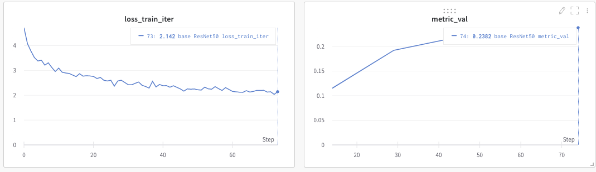
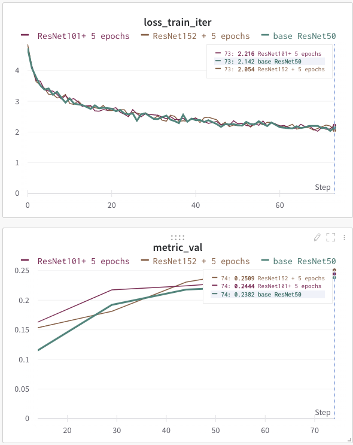
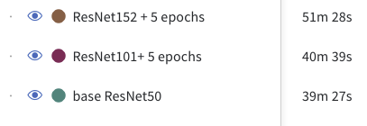
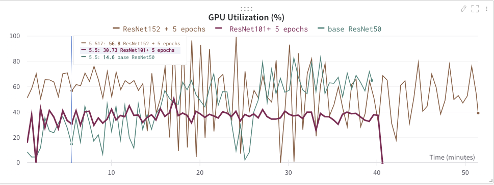
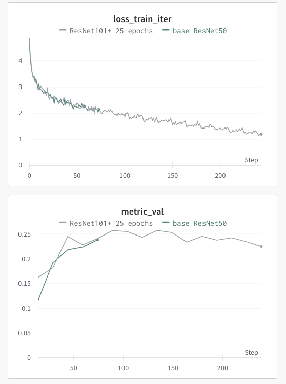
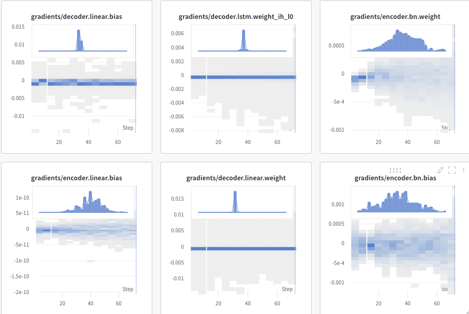
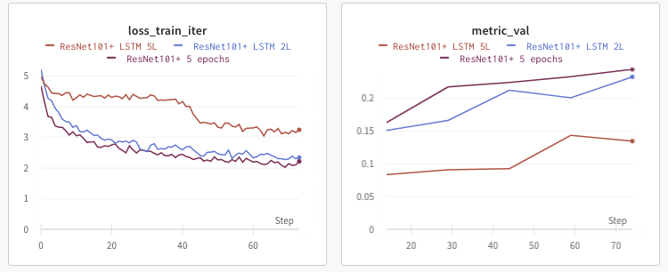
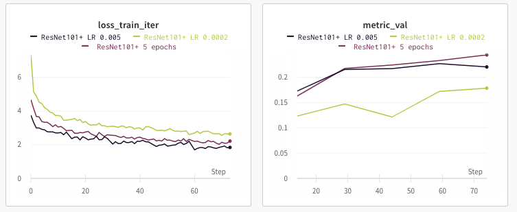
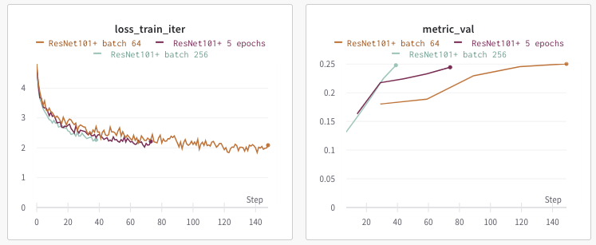

# Description

## Background

Starting each ML in an unknown domain requires:
- understanding current SOTA and most prominent models
- an exploration of existing datasets
- understanding benchmarks and target metrics

But on the initial step I decided to find any repo and just run anything. There are a lot of implementations and notebooks on Kaggle with simple models for image captioning after trying a bunch of them I decided to use the proposed experimentation framework and spent more time on exploring the subject.

### Model
In most cases for image captioning encoder-decoder approach is used. The encoder is some pretrained CNN architecture and decoder is some recurrent NN. I found a [repo](https://github.com/yunjey/pytorch-tutorial/tree/master/tutorials/03-advanced/image_captioning) of a model which uses ResNet-152 as encoder and LSTM layer(s) as decoder. It looks pretty straightforward and is nice candidate for the baseline model.

Encoder-decoder is a good approach and more architectures use some sort of combination of CNN + RNN. One of the most valuable works are [NeuralTalk](https://github.com/karpathy/neuraltalk) and [NeuralTalk2](https://github.com/karpathy/neuraltalk2) by Karpathy and Fei-Fei. 
```
Compared to the original NeuralTalk this implementation is batched, uses Torch, runs on a GPU, and supports CNN finetuning. All of these together result in quite a large increase in training speed for the Language Model (~100x), but overall not as much because we also have to forward a VGGNet.
```

More recent iteration over the above implementation is Show, [Attend and Tell: Neural Image Caption Generation with Visual Attention](https://arxiv.org/pdf/1502.03044v3.pdf) doesn't change the back bone idea of using encoder-decoder architechture but makes improvement by adding attention layer to the RNN(decoder).

Current SOTA are [Oscar](https://arxiv.org/abs/2004.06165) and it succusssor [VinVL](https://arxiv.org/abs/2101.00529) by Microsoft Research Team. They use Bert architecture and uses transformers libraty for NLP part. Repo is nicely maintained, checkpoints and datasets are shared.

### Datasets

Flickr8k, Flickr30k and MS COCO are used in most papers. There is one property that is common for all of them. Each image in dataset has more than one human-annotated caption(5 in most cases). So during training NN will see each image couple of times with different annotations. But during validation all of the captions for a given image are used at once to evaluate the quality of prediction(hypothesis).

Yet one more fun dataset to try(with multiple image per caption):

[Abstraction Scene Dataset](http://optimus.cc.gatech.edu/clipart/)


Mike and Jenny are standing by the fire while a big brown bear tries to scare the two friends.

* 1002 sets of scenes with 10 images in each.
* Reduced variability (hence complexity) than real word scenes.
* Descriptions have non-visual attributes.
* Clip-arts provide segmentation labels

### Metric

Slightly outdated but still valuable overview of [Datasets and Metrics for Image Caption
Generation](https://www.cs.toronto.edu/~fidler/slides/2017/CSC2539/Kaustav_slides.pdf)

* Bleu(1-4) are good mertris. Othet metrics(CIDEr/METEOR/ROUGE_L) are still usefull in some cases but are less frequent in research papers benckmarks.
* Validation is made on all(5) captions of one image


### Experiment framework
It took a long time to get used to the experiment framework, but I must say that the structured configurable approach with nice logging makes sense. Most of the time I spent adopting dataset classes for a specific task. I downloaded coco 2014 dataset(as this is the only available edition with image captioning annotations). I started using coco py module, then I found coco in torchvision.datasets but it was not quite useful as it does not store the vocabulary. So I decided to use custom dataset implementation.

Fixing model and configuration modules were quite easy. Most of the utility functions were used without any changes. After a few attempts I managed to kick off the training task. But there are still two main I need to overcome: 
1. There is no small dataset for image caption training - so powerful hardware with GPU is needed.
2. I need to change approach for validation and train dataset generation. 
3. I want to try cloud based service for train statictics collection.


## Plan

* Refactor experiment framefork for image captioning task
* Develop COCO and Flickr8k dataset loaders
* Use classic aproch of CNN encoder and RNN decoder
* Experiment with different depth encoder(CNN) architectures
* Experiment with different parameters - batch size, learning rate, etc.
* Examine influence of CNN fine-tuning on overall performance
* Try two different datasets small(Flickr8k) and big(COCO) report findings

<!--- ###################################################### --->
<!--- ###################################################### --->
<!--- ###################################################### --->

# Experiment journal

<!--- ###################################################### --->

## EXP01 Baseline Model

### Motivation
Train baseline model on small dataset and with the simple architecture(ResNet50). 

### Description
Training time [gpu]: ~ 39 min. (5 epochs)

BLEU-3 [val]: 0.2382
  
### Interpretation

From the plot, 



Model is slowly train - loss decreasing but validation reaches its plateau ~0.24

Model managed to catch some common patterns of imeaged, but they are oversimplified:

|hypothesis|references  |
|----------|----------|
|a group of people are riding bicycles in a race .|a police officer posing with two army officers beside his motorcycle . there are three policemen and a police motorcycle . three police officers next to a police motorcycle . three police officers pose with a motorcycle . two men in red berets pose with a motorcycle cop .
|

<!--- ###################################################### --->

## EXP02 Change encoder model architecture(ResNet101, ResNet152)

### Motivation
* Try other(deeper) models for encoder
* Compare train time and resource utilization

### Description
We train only embedding transformation of CNN output and LSTM layer so the train loss remains the same for all cases.



The main asumtion was that the deaper moder shoud produce better embedding. And as we can see this true. 

|     Encoder |     BLEU-3 |
|----------|----------|
|ResNet50| 0.2382|
|ResNet101| 0.2444|
|ResNet152| 0.2509|

Train time for ResNet50 and ResNet101 is almost similar but training model with  ResNet152 is slower.



All three models were trained on the same EC2 instance using AWS SageMaker Studio. The main limitation and blocker is [known issue](https://github.com/aws/sagemaker-python-sdk/issues/937) with AWS SM containers - they don't allow multiprocessing data loaders. AWS [proposes to modify training](https://docs.aws.amazon.com/sagemaker/latest/dg/model-parallel-customize-training-script-pt.html) scripts to support parallelism but it is an overhead for our case. As we can see from zigzagging chart below in most cases train script "waits" for the new batch of data:




So ResNet101 is the best candidate for further experiments as it is relatively fast, resource consumption is smooth and it showed better performance comparing with the baseline.

<!--- ###################################################### --->

## EXP03 Increase train time

### Motivation
* Increase training time
* Take a closer look on gradients plots

### Description



As we can see after 5-6 epochs model is overfitting(train loss is decreasing but validation BLEU-3 score is not improving). So in further experiments, we should try to fix it by:
* changing hyperparams(learning rate, batch size, embedding size)
* changing RNN depth
* finetunirng encoder
* using different data augmentation techniques

Despite overfitting we've got better(meaningful) results:

|hypothesis|references  |
|----------|----------|
|a group of people are riding on a motorcycle.|a police officer posing with two army officers beside his motorcycle . there are three policemen and a police motorcycle . three police officers next to a police motorcycle . |
|a brown dog is playing with a toy .| a brown dog chews on an orange ball . a dog bites a big orange ball . a dog has an orange ball in its mouth |

So the model manages to catch some main pieces of information from a picture: the main character, colors, actions. But still relatively to the references generated captions are less descriptive and operate with a simpler dictionary(of the most frequent words)   


Weights & Biases gives a convimient way of exploring trainable gradients. 



<!--- ###################################################### --->

## EXP04 Deeper decoder

### Motivation
Use LSTM this more layers.


### Description


Changing(extending) layers did not help. Model performance decreases while adding more layers.
<!--- ###################################################### --->

## EXP05 EXP06 Tune learning rate and try different batch sizes

### Motivation
Try different learning rates and batch sizes

### Description




Changing learning rates and batch sizes showed once more that we've reached our model/dataset top performance level(BLEU-3 ~0.25) and further improvements are possible only by changing model architecture.

<!--- ###################################################### --->

<!-- ## [e0007] COCO dataset

### Motivation


### Description -->
<!--- ###################################################### --->

# Summary

The task of image captioning is interesting because it combines techniques of two most popular ML domains: computer vision and NLP. The task is heavily researched over the last decade. Most of the recent papers have implementations and are reproducible. The repos nicely maintained by authors.

In this project, I used the simple encoder-decoder architecture for this task. The encoder is used for retrieving image embeddings and uses pre-trained model. Despite the fact that we train only decoder(RNN) and couple of layers on top of ResNet iteration even on small dataset took relatively decent amount of time. This can be explained by the fact that we need to encode images by the deep CNN.

There are dozens of different implementations of image captions models architectures on GitHub. It is easy to clone repo and kick-off training, but it is hard to make such experiments comparable. So I really enjoyed the approach with "kind of" experimental framework which decouples modes from datasets and hyperparameters and makes logging and metrics collection more convenient. It definitely takes more time to refactor some open-sourced algorithms to the common structure, but once it is done you can quickly iterate over different experiments. 

Jupyter Notebooks are the tools of choice for ML practitioners, but when it comes to reproducibility and team work it is pretty hard to use them for model training experiment. The initial implementation of the experiment framework was written as a python script,  had some tools(wisdom, tensorboard, logging) for visualization of change of training params over time. But I decided to try third-party service Weight&Biases. In my opinion, using cloud service has advantages over logging to local file system:
* you can run you train jobs from different places and still have one source of knowlende
* it is easier to collaborate with other team members

```
Experiment = Code state + given hyperparams + artifacts(dataset, checkpoints, final model)
```
With the small effort W&B glues these pieces together providing the best developer experience. So I will definitely use experimental framework and W&B for my master project and my daily work.

The current state of the art for image captioning tasks uses attention layers leveraging on transformers library. The models are trained as a multimodal generic model. And then this trained state is transferred for a more specific task. It was impossible to reproduce SOTA for this mini project in my case but my ultimate goal was to learn how to setup environment for fask experiment iteration and make initial research in a previously unknown domain.