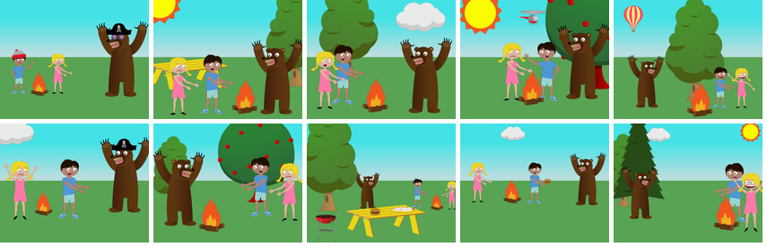

<!--- ###################################################### --->

# [e0005] Experiment with decoder model, visual attention

<!--- ###################################################### --->

# [e0003] Change encoder model architecture, freeze vs fine-tuned encoder

<!--- ###################################################### --->

# [e0002] Use flickr dataset

<!--- ###################################################### --->

# [e0001] Small Datasets

|Start Date|End Date  |
|----------|----------|
|2021-12-31|2021-12-31|

## Motivation
Find some small dataset to run first experiment
Understand metrics and dataset for image captioning task

## Description
Previous This step I started with code and this one I decided to investigate more. Encoder-decoder is a good approach and more architectures use some sort of combination of CNN + RNN. One of the most valuable(for baseline) works are [NeuralTalk](https://github.com/karpathy/neuraltalk) and [NeuralTalk2](https://github.com/karpathy/neuraltalk2) by Karpathy and Fei-Fei. 
```
Compared to the original NeuralTalk this implementation is batched, uses Torch, runs on a GPU, and supports CNN finetuning. All of these together result in quite a large increase in training speed for the Language Model (~100x), but overall not as much because we also have to forward a VGGNet.
```

[Datasets and Metrics for Image Caption
Generation](https://www.cs.toronto.edu/~fidler/slides/2017/CSC2539/Kaustav_slides.pdf)

Bleu(1-4) are good mertris  BLEU/CIDEr/METEOR/ROUGE_L

Above datasets have ~5 caption per image. How to calc metric? One or all captions? Max or avg if all?

Yet one more dataset to try:

[Abstraction Scene Dataset](http://optimus.cc.gatech.edu/clipart/)

Mike and Jenny are standing by the fire while a big brown bear tries to scare the two friends.

* 1002 sets of scenes with 10 images in each.
* Reduced variability (hence complexity) than real word scenes.
* Descriptions have non-visual attributes.
* Clip-arts provide segmentation labels


https://paperswithcode.com/paper/show-attend-and-tell-neural-image-caption

## Deliverables
  
## Interpretation

<!--- ###################################################### --->

# [e0000] Image captioning experimentation framework

|Start Date|End Date  |
|----------|----------|
|2021-12-30|2021-12-30|

## Motivation
Use given framework on a specific problem

## Description
In most cases for image captioning encoder-decoder approach is used. The encoder is some pretrained CNN architecture and decoder is some recurrent NN. I found a [repo](https://github.com/yunjey/pytorch-tutorial/tree/master/tutorials/03-advanced/image_captioning) of a model which uses ResNet-152 as encoder and LSTM layer(s) as decoder. It looks pretty straightforward and is nice candidate for the baseline model.

It took a long time to get used to the experiment framework, but I must say that the structured configurable approach with nice logging makes sense. Most of the time I spent adopting dataset classes for a specific task. I downloaded coco 2014 dataset(as this is the only available edition with image captioning annotations). I started using coco py module, then I found coco in torchvision.datasets but it was not quite useful as it does not store the vocabulary. So I decided to use custom dataset implementation.


Fixing model and configuration modules were quite easy. Most of the utility functions were used without any changes. After a few attempts I managed to kick off the training task. But there are still two main issues: 
1. There is no small dataset for image caption training - so powerful hardware with GPU is needed.
2. I haven't implemented any metric(s). There are some like Rouge and Bleu but they mainly use intersection between words in two sentences. So some manual evaluation will be needed after each experiment

## Deliverables
- Experimentation framework refactored and extended for image captioning problem
- Tested on pretrained model
- Implemented data class for COCO image caption dataset

## TODOS
- Define metric(s)
- Check model and experiment analysis notebooks